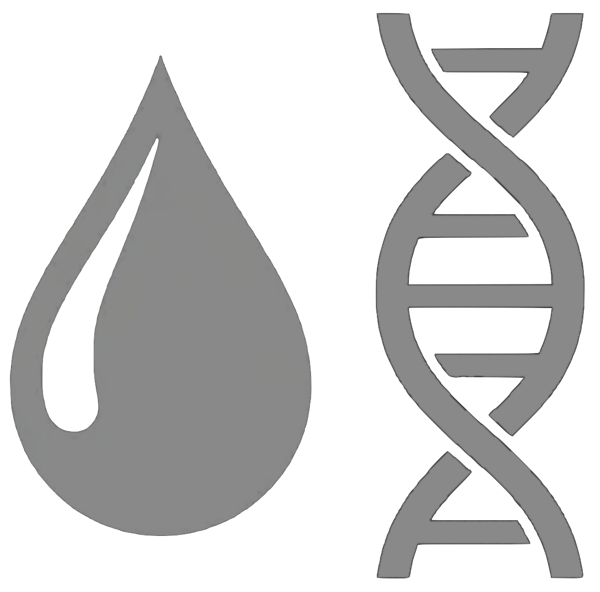

# Newborn-Screening 

Architecture uses [Express](https://expressjs.com/). 
Templating done via [EJS](https://ejs.co/). 

## Install Docker
This example uses Docker, the links below can help you get Docker installed.
* Mac users: https://www.docker.com/products/docker-desktop
    * Follow installer
* Windows users: https://github.com/docker/toolbox/releases
    * Download latest .exe file
    * Follow installer

## Start the app server
Open the Terminal app (Mac) or the Docker Quickstart Terminal (Windows), go to the home directory of this project.

Launch the server with the command <code>docker-compose -p nbs up --build &</code>

Open browser to:
*  http://localhost:8080/ (Mac)
*  http://192.168.99.100:8080/ (Windows)

Additional Docker commands:
* View server output: <code>docker logs nbs\_app_1</code>
* Stop server: <code>docker stop nbs\_app_1</code>
* Start server again: <code>docker start nbs\_app_1</code>
* To wipe a previous build if you want to start over:
    * <code>docker stop nbs\_app_1</code>
    * <code>docker rm nbs\_app_1</code>
    * <code>docker rmi nbs\_app</code>
    * <code>docker volume prune</code>
